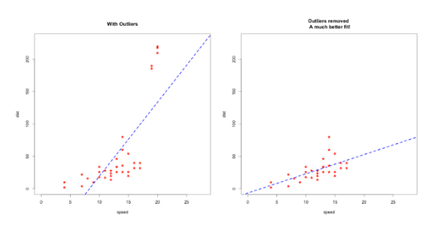

## Anomaly Detection
### Introduction: Anomaly Detection

Anomaly detection is a technique used to identify unusual patterns that do not conform to expected behavior, **called outliers.** It has many applications in business, from *intrusion detection* (identifying strange patterns in network traffic that could signal a hack) to *system health monitoring* (spotting a malignant tumor in an MRI scan), and from *fraud detection* (in credit card transactions) to *fault detection* (in operational machinery environments).

### What Are Anomalies?
Anomalies can be broadly categorized as:

>Point anomalies: A single instance of data is anomalous if it's too far off from the rest. 
Business use case: Detecting credit card fraud based on "amount spent."

>Contextual anomalies: The abnormality is context-specific. This type of anomaly is common in time-series data. 
Business use case: Spending $100 on food every day during the holiday season is normal, but may be odd otherwise.

>Collective anomalies: A set of data instances collectively helps in detecting anomalies. 
Business use case: Someone is trying to copy data form a remote machine to a local host unexpectedly, an anomaly that would be flagged as a potential cyber attack.

Anomaly detection is similar to - *but not entirely the same as* - noise removal and novelty detection. Novelty detection is concerned with identifying an unobserved pattern in new observations not included in training data - like a sudden interest in a new channel on YouTube, for instance. Noise removal (NR) is the process of immunizing analysis from the occurrence of unwanted observations; in other words, removing noise from an otherwise meaningful signal.

### Why do we need to Detect Outliers?
Outliers can impact the results of our analysis and statistical modeling in a drastic way. Check out the below image to visualize what happens to a model when outliers are present versus when they have been dealt with:

#### But here's the caveat - outliers aren't always a bad thing. It's very important to understand this. Simply removing outliers from your data without considering how they'll impact the results is a recipe for disaster.

Our tendency is to use straightforward methods like box plots, histograms and scatter-plots to detect outliers. But dedicated outlier detection algorithms are extremely valuable in fields which process large amounts of data and require a means to perform pattern recognition in larger datasets.

>Applications like fraud detection in finance and intrusion detection in network security require intensive and accurate techniques to detect outliers. Can you imagine how embarrassing it would be if you detected an outlier and it turned out to be genuine?

### Anomaly Detection Techniques
#### Simple Statistical Methods
The simplest approach to identifying irregularities in data is to flag the data points that deviate from common statistical properties of a distribution, including mean, median, mode, and quantiles. Let's say the definition of an anomalous data point is one that deviates by a certain standard deviation from the mean. Traversing mean over time-series data isn't exactly trivial, as it's not static. You would need a rolling window to compute the average across the data points. Technically, this is called a rolling average or a moving average, and it's intended to smooth short-term fluctuations and highlight long-term ones. Mathematically, an n-period simple moving average can also be defined as a "low pass filter." (A Kalman filter is a more sophisticated version of this metric; you can find a very intuitive explanation of it [here](http://www.bzarg.com/p/how-a-kalman-filter-works-in-pictures/))

Challenges
The low pass filter allows you to identify anomalies in simple use cases, but there are certain situations where this technique won't work. Here are a few:

* The data contains noise which might be similar to abnormal behavior because the boundary between normal and abnormal behavior is often not precise.
* The definition of abnormal or normal may frequently change, as malicious adversaries constantly adapt themselves. Therefore, the threshold based on the moving average may not always apply.
* The pattern is based on seasonality. This involves more sophisticated methods, such as decomposing the data into multiple trends in order to identify the change in seasonality.

#### Machine Learning-Based Approaches
Below is a brief overview of popular ML-based techniques for anomaly detection.

* Density-Based Anomaly Detection - Is based on the k-nearest neighbors algorithm.
Assumption: Normal data points occur around a dense neighborhood and abnormalities are far away.
The nearest set of data points are evaluated using a score, which could be Eucledian distance or a similar measure dependent on the type of the data (categorical or numerical). They could be broadly classified into two algorithms:

>K-nearest neighbor: k-NN is a simple, non-parametric lazy learning technique used to classify data based on similarities in distance metrics such as Euclidian, Manhattan, Minkowski, or Hamming distance.

>Relative density of data: This is better known as local outlier factor (LOF). This concept is based on a distance metric called reachability distance.

* Clustering-Based Anomaly Detection - Clustering is one of the most popular concepts in the domain of unsupervised learning.
Assumption: Data points that are similar tend to belong to similar groups or clusters, as determined by their distance from local centroids.

>K-means is a widely used clustering algorithm. It creates 'k' similar clusters of data points. Data instances that fall outside of these groups could potentially be marked as anomalies.

>Support Vector Machine-Based Anomaly Detection - A support vector machine is another effective technique for detecting anomalies. A SVM is typically associated with supervised learning, but there are extensions (OneClassCVM, for instance) that can be used to identify anomalies as an unsupervised problems (in which training data are not labeled). The algorithm learns a soft boundary in order to cluster the normal data instances using the training set, and then, using the testing instance, it tunes itself to identify the abnormalities that fall outside the learned region.

Depending on the use case, the output of an anomaly detector could be numeric scalar values for filtering on domain-specific thresholds or textual labels (such as binary/multi labels).

* PyOD for Outlier Detection - This is a scalable Python toolkit for detecting outliers in multivariate data. It provides access to around 20 outlier detection algorithms under a single [well-documented](https://pyod.readthedocs.io/en/latest/) API.

#### Outlier Detection Algorithms used in PyOD
Let's see the outlier detection algorithms that power PyOD. It's well and good implementing PyOD but I feel it's equally important to understand how it works underneath. This will give you more flexibility when you're using it on a dataset.

Note: We will be using a term Outlying score in this section. It means every model, in some way, scores a data point than uses threshold value to determine whether the point is an outlier or not.

##### Angle-Based Outlier Detection (ABOD)
It considers the relationship between each point and its neighbor(s). It does not consider the relationships among these neighbors. The variance of its weighted cosine scores to all neighbors could be viewed as the outlying score

* ABOD performs well on multi-dimensional data
* PyOD provides two different versions of ABOD:
* Fast ABOD: Uses k-nearest neighbors to approximate
* Original ABOD: Considers all training points with high-time complexity

##### k-Nearest Neighbors Detector

* For any data point, the distance to its kth nearest neighbor could be viewed as the outlying score
* PyOD supports three kNN detectors:
* Largest: Uses the distance of the kth neighbor as the outlier score
* Mean: Uses the average of all k neighbors as the outlier score
* Median: Uses the median of the distance to k neighbors as the outlier score

##### Isolation Forest

* It uses the scikit-learn library internally. In this method, data partitioning is done using a set of trees. Isolation Forest provides an anomaly score looking at how isolated the point is in the structure. The anomaly score is then used to identify outliers from normal observations
* Isolation Forest performs well on multi-dimensional data

##### Histogram-based Outlier Detection

* It is an efficient unsupervised method which assumes the feature independence and calculates the outlier score by building histograms
* It is much faster than multivariate approaches, but at the cost of less precision

##### Local Correlation Integral (LOCI)

* LOCI is very effective for detecting outliers and groups of outliers. It provides a LOCI plot for each point which summarizes a lot of the information about the data in the area around the point, determining clusters, micro-clusters, their diameters, and their inter-cluster distances
* None of the existing outlier-detection methods can match this feature because they output only a single number for each point

##### Feature Bagging

* A feature bagging detector fits a number of base detectors on various sub-samples of the dataset. It uses averaging or other combination methods to improve the prediction accuracy
* By default, Local Outlier Factor (LOF) is used as the base estimator. However, any estimator could be used as the base estimator, such as kNN and ABOD
* Feature bagging first constructs n sub-samples by randomly selecting a subset of features. This brings out the diversity of base estimators. Finally, the prediction score is generated by averaging or taking the maximum of all base detectors

##### Clustering Based Local Outlier Factor

* It classifies the data into small clusters and large clusters. The anomaly score is then calculated based on the size of the cluster the point belongs to, as well as the distance to the nearest large cluster

##### Extra Utilities provided by PyOD

* A function generate_data can be used to generate random data with outliers. Inliers data is generated by a multivariate Gaussian distribution and outliers are generated by a uniform distribution.
* We can provide our own values of outliers fraction and the total number of samples that we want in our dataset. We will use this utility function to create data in the implementation part
